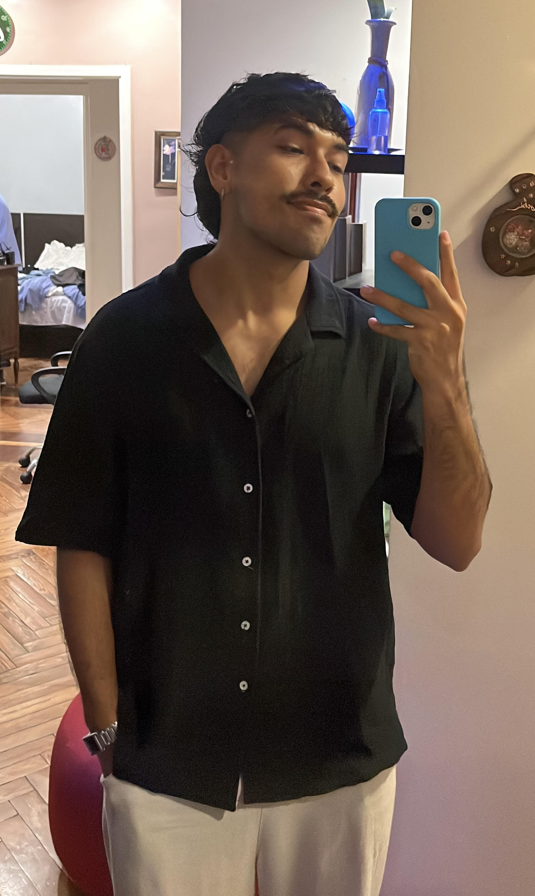

# TP0
## Presentacion personal
Buenas, soy Fabrizio Sanabria Paez, legajo:176.672-7. Tengo 23 años y estoy estudiando ingenieria en sistemas. 

Desde chico siempre fui muy pegado a la tecnologia, lo tipico siempre desarmaba todo para ver como funcionan, y ya de grande ya me interesaba mas como es que todo lo que vemos funciona internamente. Tambien tengo otro lado que es el cine, me encanta desde muy chico, me acuerdo del momento de ver una peli con mis papas y mi hermano, y me parece que por eso es que disfruto tanto el ver peliculas y al igual que con la tecnologia, me paso mas de grande el ver como es que se hacian, la fotografia y la direccion. Y mi tercer lado es la musica, escuchando desde bebe rock hasta hoy en dia yendo a cualquier recital o festival que pueda. Toco el bajo y siempre quise aprender saxofon. En si esa es mi vida.

